# 动效 Prompt 银行 · Motion Prompt Bank

**想做哪种动画，就抄哪条 prompt。** 每个条目 = 一张 GIF（这条 prompt 实际渲染出来的效果）+ 一条复制即用的 prompt。把 prompt 交给你的 coding agent（Claude Code / Codex 都行），配合 [HyperFrames](https://www.npmjs.com/package/hyperframes) 渲染成视频。

> 这些不是"大概能出个类似效果"的 prompt —— 每张 GIF 都是用旁边那条 prompt 真实构建渲染出来的。

**怎么用:** 看 [getting-started.md](getting-started.md)（3 步：init → 贴 prompt → render）。

**想投稿自己的动效?** 看 [CONTRIBUTING.md](CONTRIBUTING.md) —— GIF 必须由你的 prompt 真实渲染出来。 · **Want to submit your own?** See [CONTRIBUTING.md](CONTRIBUTING.md).

---

## 🅰 Logo 动画 · Logo Animations

| 预览 | 名称 | 效果 |
|---|---|---|
|  | [描边发光 Logo 亮起](logo/01-stroke-glow-reveal.md) | 线条光笔描画点亮 + 光斑奔跑 + 字标升起 |
|  | [巨字重锤字标](logo/02-kinetic-wordmark-slam.md) | 品牌词一记硬砸入场，落地后微呼吸 |
|  | [RGB 色散快闪](logo/03-rgb-split-sting.md) | 红绿蓝色散抖动，"咔"地锁定 — 电子签名 |
|  | [液态融合 Logo](logo/04-liquid-metaball-morph.md) | 液滴游动融合成一个整体 logo |
| 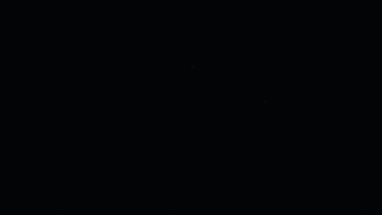 | [粒子聚形 Logo](logo/05-particle-assembly.md) | 成百光点飞来拼成 logo |
| 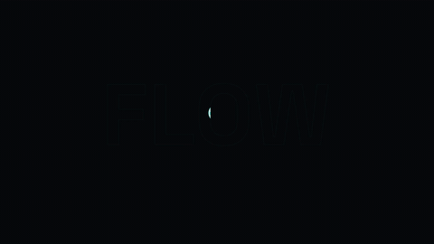 | [液体灌注 Logo](logo/06-liquid-fill-reveal.md) | 液体从底部涨上来把 logo 灌满 |
| 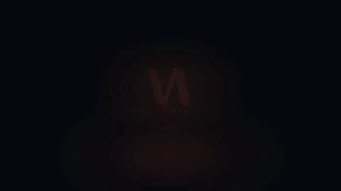 | [3D 立体旋转 Logo](logo/07-3d-extrude-spin.md) | 带厚度的 logo 在空间里旋转飞入 |
| 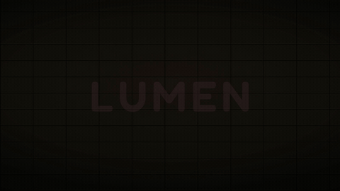 | [霓虹点亮 Logo](logo/08-neon-flicker-on.md) | 霓虹灯管通电闪烁点亮 |

## 🅱 产品广告 · Product Ads

| 预览 | 名称 | 效果 |
|---|---|---|
|  | [手机 App 演示广告](product-ads/01-phone-mockup-ad.md) | 3D 视角手机里 App 真实"用起来" |
|  | [产品特性标注广告](product-ads/02-feature-callout-ad.md) | 标注线从产品上长出来，特性依次点亮 |
|  | [Before/After 对比擦除](product-ads/03-before-after-wipe.md) | 发光分割线把"之前"擦成"之后" |
|  | [结尾 CTA 卡](product-ads/04-cta-end-card.md) | logo 落定 + 按钮呼吸 + 指尖点击 |
| 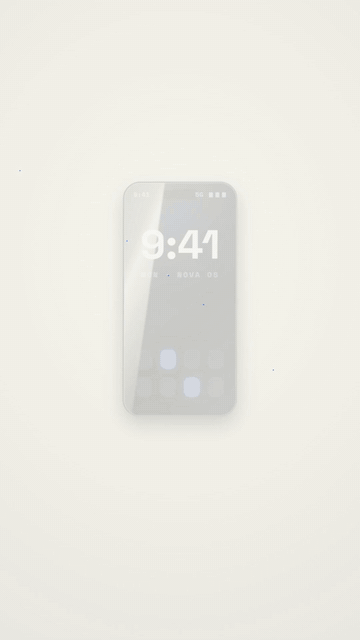 | [爆炸拆解广告](product-ads/05-exploded-view.md) | 零件炸开悬浮标注，再严丝合缝复原 |
|  | [好评口碑广告](product-ads/06-review-social-proof.md) | 五星点亮、好评卡叠入、头像墙铺开 |
|  | [降价爆点广告](product-ads/07-price-drop-stamp.md) | 原价划掉、新价砸下、限时印章 + 倒计时 |

## 🅲 数据动画 · Data Animations

| 预览 | 名称 | 效果 |
|---|---|---|
|  | [数据战报仪表盘](data/01-countup-dashboard.md) | 主指标滚动跳涨，副指标依次点亮 |
|  | [柱状图生长](data/02-bar-chart-grow.md) | 柱子按节奏长起来，冠军最后落地 |
|  | [折线图描画 + 标注](data/03-line-chart-draw.md) | 趋势线一笔画出，关键点位弹标注 |
|  | [环形图扫入](data/04-donut-sweep.md) | 环形分段扫入，圆心数字滚动，主段高亮 |
| 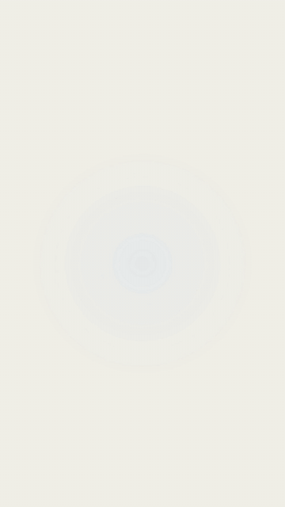 | [图标阵列占比](data/05-pictograph-isotype.md) | 图标依次点亮，"10 个里有 7 个" |
|  | [横向条形竞速榜](data/06-bar-chart-race.md) | 条形你追我赶、名次实时重排 |
| 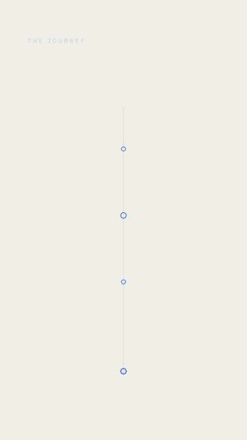 | [时间线里程碑](data/07-timeline-milestones.md) | 主线画出，里程碑节点依次弹入 |

## 🅳 字幕动效 · Caption Motion Graphics

先看 [captions/README.md](captions/README.md) —— 什么时候用哪一档。

| 预览 | 名称 | 效果 |
|---|---|---|
|  | [巨字重锤](captions/01-hero-slam.md) | 关键词说出的那一帧，巨字硬砸进画面 |
|  | [逐字卡拉OK](captions/02-word-pop-karaoke.md) | 说到哪个词哪个词弹起变色 |
|  | [人后穿字](captions/03-behind-subject-ghost.md) | 巨字从人身后穿过，瞬间有纵深 |
|  | [RGB 故障字](captions/04-rgb-glitch-caption.md) | 色散抖动锁定 — 一条视频用一次 |
|  | [手写海报叠字](captions/05-script-poster-stack.md) | 粗黑海报骨架 + 手写签名描画 |
|  | [咬合字块](captions/06-interlock-stack.md) | 单词像填字游戏咬合成一个字块 |
|  | [荧光笔药丸字](captions/07-highlighter-pills.md) | 荧光药丸一颗颗盖章落下 |
|  | [冲脸巨字](captions/08-zpunch-camera-fly.md) | 单词从画面深处飞到你脸上 |
|  | [字后穿字](captions/09-text-behind-text.md) | 一个词从另一个巨字的笔画后滑过 |
|  | [环绕字光环](captions/10-word-halo.md) | 单词沿椭圆环绕在人物头部周围 |
|  | [满幅散布巨字](captions/11-scatter-fullbleed.md) | 巨字散布人物四周，有的藏进身后 |
|  | [焦点拉字](captions/12-rackfocus-blur.md) | 文字和人物在同一镜头里拉焦点 |
| 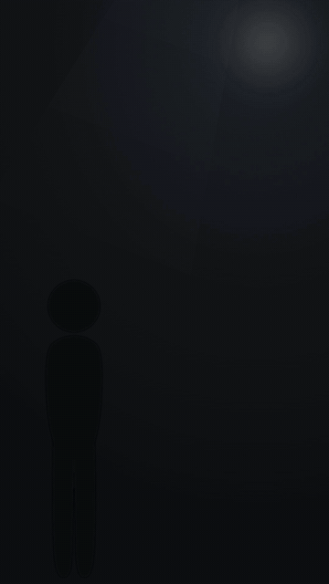 | [弧线滚落字](captions/13-cascade-path-text.md) | 整句沿弧线绕着人物滚落，词贴切线角度 |
|  | [声波律动字](captions/14-audio-reactive-ripple.md) | 字母跟着人声波形起伏 — 被声音推着动 |

## 🅴 发布片场景 · Launch-Trailer Scenes

16:9 电影感画幅（1920×1080），产品发布片 / launch trailer 的整场镜头 — 逆向自真实 AI 产品发布片的可复用场景。

| 预览 | 名称 | 效果 |
|---|---|---|
| 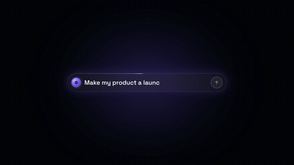 | [提示词输入条开场](trailer/01-prompt-bar-hero.md) | 发光输入条逐字打出、光标点击发送、炸出巨字宣言 |
| 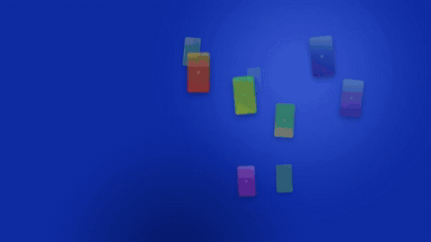 | [成片墙爆开](trailer/02-video-wall-mosaic.md) | 几十张成片卡从景深飞入散落成墙，"50 videos. one upload." |
| 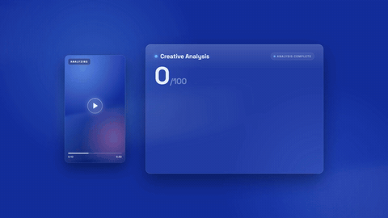 | [AI 评分面板](trailer/03-ai-scorecard-panel.md) | 玻璃面板滑入：分数滚动、星星点亮、指标卡叠入 |
|  | [Agent 任务流](trailer/04-agent-task-stream.md) | 状态点依次亮起 + AI 思考文字流式打出带荧光高亮 |
|  | [关键词连线快闪](trailer/05-keyword-path-sting.md) | 渐变光线划过，划到哪儿哪个关键词弹出，合体成宣言 |
|  | [功能星环 Logo](trailer/06-feature-orbit-logo.md) | logo 落定中心，功能胶囊带迷你 UI 绕着漂浮 |
| 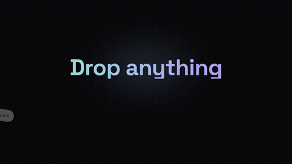 | [万物拖入](trailer/07-drop-anything-stack.md) | 链接/文档/图片/视频甩进画面，巨字被撞，吸入发光槽 |
|  | [极光玻璃面板](trailer/08-aurora-glass-panels.md) | 极光虚空里玻璃 UI 面板漂浮，色块片段依次点亮 |
| 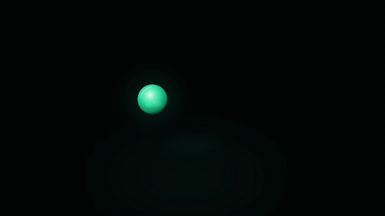 | [光球等式卡](trailer/09-orb-equation-card.md) | 发光球拉伸成箭头："1 hour → 20 seconds" 视觉等式 |
| 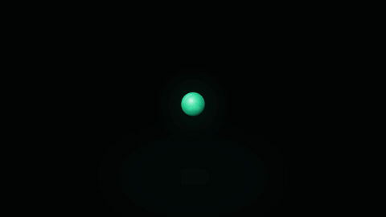 | [两端分置字幕](trailer/10-split-edge-captions.md) | 短语拆两半飞向画面两缘，包夹中间主体 |
| 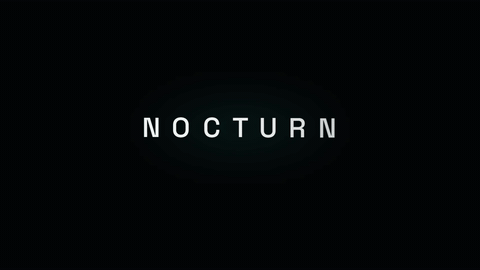 | [字标变身](trailer/11-wordmark-morph.md) | 字标 A 变身字标 B — 共用字母滑行、新字母从光点长出 |
| 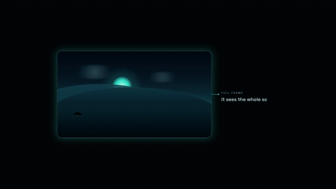 | [画框破格](trailer/12-frame-breakout.md) | 内容在发光画框里播，重点一到撑满全屏 |
|  | [光标演一遍](trailer/13-cursor-ui-performance.md) | 光标把产品 UI 用一遍：打字、选卡、开关、Generate |
|  | [流水线拆解](trailer/14-conveyor-stages.md) | 整块裂成四个阶段块过工位，右侧合体驶出 |
|  | [爪机抓空](trailer/15-claw-grab-miss.md) | 机械爪两次抓不走发光信物 —"有些东西抓不走" |

## 🅵 转场 · Scene Transitions

场景与场景之间的"世界切换"装置。demo 为 9:16（1080×1920），同一套语法直接可用于 16:9。

| 预览 | 名称 | 效果 |
|---|---|---|
|  | [圆形吞没转场](transitions/01-circle-swallow-takeover.md) | 暗圆窗涌出吞掉亮色世界，金句后再退回 |
|  | [舷窗开阖](transitions/02-iris-porthole-reveal.md) | 圆形观测窗虹膜式旋开，窗里是另一个世界 |
|  | [变形匹配剪辑](transitions/03-morph-match-cut.md) | 一个物体连续变形穿过三个场景，视线永不断 |

## 🅶 手绘动画 · Sketch Animation

纸上手绘感的动效语言：沸腾线 + 可表演的手绘角色。9:16（1080×1920）。

| 预览 | 名称 | 效果 |
|---|---|---|
|  | [沸腾线手绘场景](sketch/01-boiling-line-scene.md) | 线稿画出自己，整幅画永远在轻微"沸腾" |
| 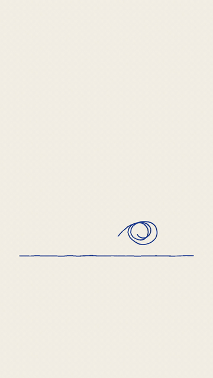 | [手绘小人演员](sketch/02-sketch-puppet-actor.md) | 有关节的手绘小人真的在演：走、抓、拽、拍手 |

## 🅷 打击特效 · Impact VFX

游戏级打击感与能量特效，零素材纯代码。16:9（1920×1080）。

| 预览 | 名称 | 效果 |
|---|---|---|
| 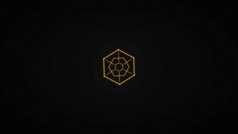 | [冲击波命中](vfx/01-impact-shockwave.md) | 白闪 + 冲击环 + 火花 + 飘字 + 创伤值震屏 |
| 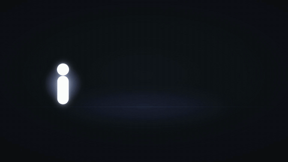 | [残影拖尾](vfx/02-afterimage-echo-trail.md) | 冲刺留下一串渐隐分身，间距随加速度拉伸 |
|  | [符文法阵](vfx/03-rune-sigil-circle.md) | 双环法阵自己画出来，符文逐个点亮到爆发 |

---

## English

**A copy-paste prompt bank for HTML motion graphics.** Each entry pairs a GIF (the actual render) with the exact prompt that produced it. Hand the prompt to your coding agent (Claude Code / Codex) and render with [HyperFrames](https://www.npmjs.com/package/hyperframes) — see [getting-started.md](getting-started.md).

Eight categories: **Logo animations** (8: stroke-glow reveal / kinetic wordmark slam / RGB-split sting / liquid metaball morph / particle assembly / liquid fill / 3D extrude spin / neon flicker-on) · **Product ads** (7: phone-mockup / feature callouts / before-after wipe / CTA end-card / exploded view / review social-proof / price-drop stamp) · **Data animations** (7: count-up dashboard / bar-chart grow / line-chart draw / donut sweep / pictograph isotype / bar-chart race / timeline milestones) · **Caption motion graphics** (14: hero slam / word-pop karaoke / behind-subject ghost / RGB glitch / script-poster stack / interlock stack / highlighter pills / z-punch camera fly / text-behind-text / word halo / scatter full-bleed / rack-focus blur / cascade-path text / audio-reactive ripple — register guide in [captions/README.md](captions/README.md)) · **Launch-trailer scenes** (15, all 16:9 cinematic, reverse-engineered from real AI-product launch films: prompt-bar typing hero / video-wall mosaic / AI scorecard panel / agent task stream / keyword path sting / feature-orbit logo / drop-anything stack / aurora glass panels / orb equation card / split-edge captions / wordmark morph / frame break-out / cursor UI performance / conveyor stages / claw grab-and-miss) · **Scene transitions** (3: circle-swallow takeover / iris porthole reveal / morph match-cut) · **Sketch animation** (2: boiling-line scene / sketch puppet actor) · **Impact VFX** (3: impact shockwave / afterimage echo trail / rune sigil circle).

Every prompt is self-contained with `{PLACEHOLDER}` tokens for your brand, copy, and data. The GIFs were rendered from these exact prompts — what you see is what the prompt builds.

## License

[CC BY-NC-SA 4.0](LICENSE) — use and remix with credit, non-commercial. Videos you render from these prompts are yours.

Made by [小蓝不打工了 / Cindy Spark](https://github.com/cindyxu1030).
