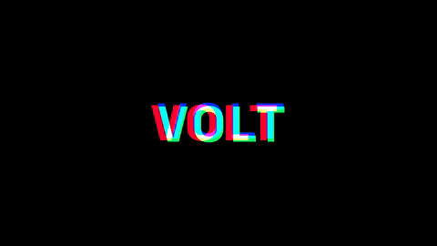
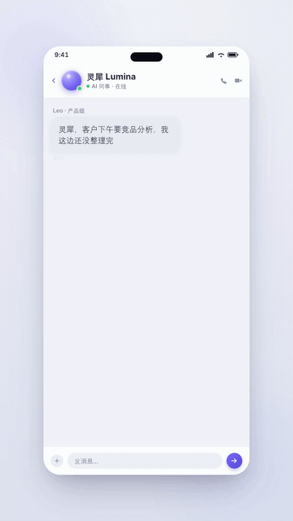
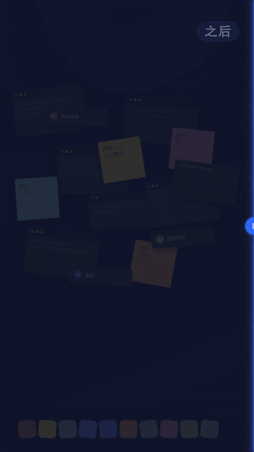
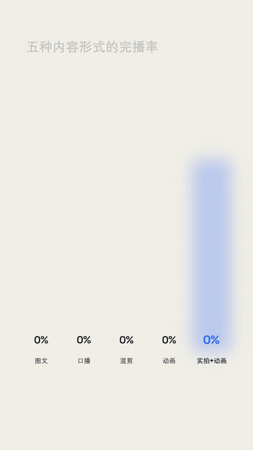
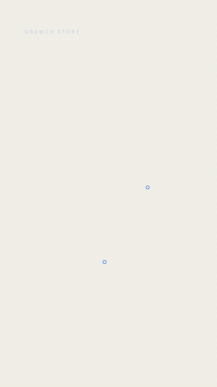
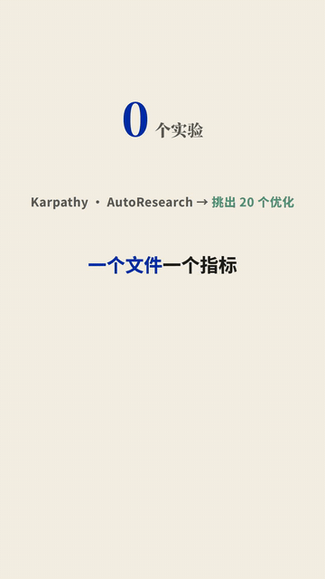
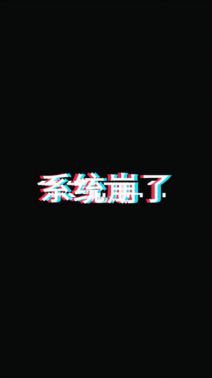

# 动效 Prompt 银行 · Motion Prompt Bank

**想做哪种动画，就抄哪条 prompt。** 每个条目 = 一张 GIF（这条 prompt 实际渲染出来的效果）+ 一条复制即用的 prompt。把 prompt 交给你的 coding agent（Claude Code / Codex 都行），配合 [HyperFrames](https://www.npmjs.com/package/hyperframes) 渲染成视频。

> 这些不是"大概能出个类似效果"的 prompt —— 每张 GIF 都是用旁边那条 prompt 真实构建渲染出来的。

**怎么用:** 看 [getting-started.md](getting-started.md)（3 步：init → 贴 prompt → render）。

---

## 🅰 Logo 动画 · Logo Animations

| 预览 | 名称 | 效果 |
|---|---|---|
|  | [描边发光 Logo 亮起](logo/01-stroke-glow-reveal.md) | 线条光笔描画点亮 + 光斑奔跑 + 字标升起 |
|  | [巨字重锤字标](logo/02-kinetic-wordmark-slam.md) | 品牌词一记硬砸入场，落地后微呼吸 |
|  | [RGB 色散快闪](logo/03-rgb-split-sting.md) | 红绿蓝色散抖动，"咔"地锁定 — 1.5 秒电子签名 |

## 🅱 产品广告 · Product Ads

| 预览 | 名称 | 效果 |
|---|---|---|
|  | [手机 App 演示广告](product-ads/01-phone-mockup-ad.md) | 3D 视角手机里 App 真实"用起来" |
|  | [产品特性标注广告](product-ads/02-feature-callout-ad.md) | 标注线从产品上长出来，特性依次点亮 |
|  | [Before/After 对比擦除](product-ads/03-before-after-wipe.md) | 发光分割线把"之前"擦成"之后" |
|  | [结尾 CTA 卡](product-ads/04-cta-end-card.md) | logo 落定 + 按钮呼吸 + 指尖点击 |

## 🅲 数据动画 · Data Animations

| 预览 | 名称 | 效果 |
|---|---|---|
|  | [数据战报仪表盘](data/01-countup-dashboard.md) | 主指标滚动跳涨，副指标依次点亮 |
|  | [柱状图生长](data/02-bar-chart-grow.md) | 柱子按节奏长起来，冠军最后落地 |
|  | [折线图描画 + 标注](data/03-line-chart-draw.md) | 趋势线一笔画出，关键点位弹标注 |

## 🅳 字幕动效 · Caption Motion Graphics

先看 [captions/README.md](captions/README.md) —— 什么时候用哪一档。

| 预览 | 名称 | 效果 |
|---|---|---|
|  | [巨字重锤](captions/01-hero-slam.md) | 关键词说出的那一帧，巨字硬砸进画面 |
|  | [逐字卡拉OK](captions/02-word-pop-karaoke.md) | 说到哪个词哪个词弹起变色 |
|  | [人后穿字](captions/03-behind-subject-ghost.md) | 巨字从人身后穿过，瞬间有纵深 |
|  | [RGB 故障字](captions/04-rgb-glitch-caption.md) | 色散抖动锁定 — 一条视频用一次 |
|  | [手写海报叠字](captions/05-script-poster-stack.md) | 粗黑海报骨架 + 手写签名描画 |

---

## English

**A copy-paste prompt bank for HTML motion graphics.** Each entry pairs a GIF (the actual render) with the exact prompt that produced it. Hand the prompt to your coding agent (Claude Code / Codex) and render with [HyperFrames](https://www.npmjs.com/package/hyperframes) — see [getting-started.md](getting-started.md).

Four categories: **Logo animations** (stroke-glow reveal / kinetic wordmark slam / RGB-split sting) · **Product ads** (phone-mockup demo / feature callouts / before-after wipe / CTA end-card) · **Data animations** (count-up dashboard / bar-chart grow / line-chart draw) · **Caption motion graphics** (hero slam / word-pop karaoke / behind-subject ghost / RGB glitch / script-poster stack — register guide in [captions/README.md](captions/README.md)).

Every prompt is self-contained with `{PLACEHOLDER}` tokens for your brand, copy, and data. The GIFs were rendered from these exact prompts — what you see is what the prompt builds.

## License

[CC BY-NC-SA 4.0](LICENSE) — use and remix with credit, non-commercial. Videos you render from these prompts are yours.

Made by [小蓝不打工了 / Cindy Spark](https://github.com/cindyxu1030).
