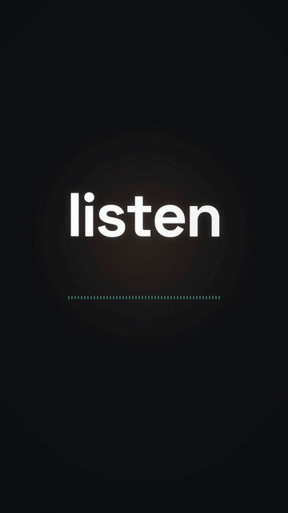

# 声波律动字 · Audio-Reactive Ripple



**效果:** 巨字的每个字母跟着人声波形起伏 — 说话重音处字母荡起涟漪、轻处归于平静，底下一条波形同步呼吸。字不再是"按时间点动"，而是"被声音推着动"。
*What it delivers: each letter of the hero word rides the voice waveform — rippling on the stressed syllables, settling in the quiet — with a live waveform strip breathing underneath. Type that's pushed by the sound, not just timed to it.*

## Prompt（复制给你的 coding agent · copy-paste to your coding agent）

```text
Create a 1080x1920 vertical HyperFrames composition — an "audio-reactive
hero word" caption scene on {BACKDROP — your footage, or the demo stage:
deep charcoal #121317 with one dim warm pool}. Duration ~6s.

The hero word: {HERO, e.g. "listen"} — heavy black-weight lowercase,
~230px, white, centered at ~42% height, each LETTER its own span.
Accent: {ACCENT, e.g. #35E0C8}. Below it at ~58% height: a waveform
strip (48 thin vertical bars, 4px wide, accent color at 65%).

The amplitude data: {AMPLITUDE — per-frame RMS envelope of your VO,
extracted via ffmpeg astats/whisper; for the demo, bake a deterministic
30-value-per-second envelope array that mimics a spoken phrase: two
strong syllable peaks (~0.9), a mid bump (~0.5), breath gaps near 0,
gentle noise floor ~0.08 derived from index trig}. Hard rule: the array
is a CONSTANT in the code — never computed from Math.random or time.

Wire amplitude → motion (the entire technique):
- Sample the envelope at the timeline's current time via a driver tween
  (an object {t} tweened 0→duration, linear) whose onUpdate reads
  env[Math.floor(t*30)] — deterministic under seek.
- Letters: y-offset = -amp * 14px and scale = 1 + amp*0.05, with each
  letter reading the envelope OFFSET by its index (i*2 frames) so peaks
  ripple THROUGH the word left→right like a wave, not a pogo jump.
- Letter color: at amp > 0.75 the letter nearest the wave crest tints
  {ACCENT} for that moment (threshold, not tween).
- Waveform strip: bar i's height = 8 + env[(frame - i) clamped]*72px —
  the strip scrolls the history of the voice.

Animation timeline (~6s):
- 0.0–0.7s  hero word letters rise in (y 24→0, 40ms stagger, blur 4→0);
            waveform bars fade up at floor height.
- 0.7–5.2s  the envelope drives everything: word ripples on each
            syllable peak, strip dances; on the BIGGEST peak (~2.8s)
            add one accent ring ripple expanding from the word
            (scale 1→1.6, opacity .5→0 — the ring starts hidden:
            autoAlpha 0 + immediateRender: false on its fromTo, or it
            leaks into every frame before its beat).
- 5.2–6.0s  the envelope decays to the noise floor: letters settle to a
            barely-visible idle sway, strip flattens to a calm pulse —
            the voice "finishing its sentence".

Render safety (required): one paused GSAP timeline on
window.__timelines["main"]; the envelope is a baked constant array
indexed by timeline time (fully deterministic under seek); no
Math.random / Date.now; finite repeats; root div with
data-composition-id="main" data-duration="6" data-width="1080"
data-height="1920".
```

## 要点 Key technique notes

- **振幅按"字母 index 错开 2 帧"读取** — 波峰从左往右穿过单词才是"涟漪"；所有字母同相位就是整词蹦迪。
- 幅度要克制：y ≤14px、scale ≤5% — johnbucog 的字是"被声音呼吸着"，不是被声音殴打。
- 真实使用时 envelope 来自你 VO 的逐帧 RMS（ffmpeg astats 或 whisper 流程）；demo 里烘焙成常量数组 — 确定性是硬规则。
- 底部波形条显示的是"声音的历史"（每根条读 frame-i 的值）— 它让观众看懂字为什么在动。
