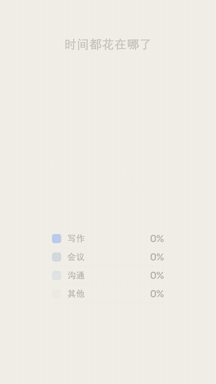

# 环形图扫入 · Donut Chart Sweep



**效果:** 环形图的每段沿圆周扫开生长，圆心的主数字跟着滚动，扫到最大那段时高亮弹出 — 占比类数据的干净镜头。
*What it delivers: the donut's segments sweep open around the ring as the center number counts up, the biggest slice highlighting as it lands — the clean shot for any share-of-total data.*

## Prompt（复制给你的 coding agent · copy-paste to your coding agent）

```text
Create a 1080x1920 vertical HyperFrames composition — a 6-second animated
donut chart on {BG — flat #F4F1EA or dark #101216}.

Title: {TITLE e.g. "时间都花在哪了"}. Segments (3-5, label + value): {LABEL:
VALUE — e.g. 写作 42 / 会议 26 / 沟通 18 / 其他 14}. Center hero: {HERO — e.g.
the top segment's % or a total}. Palette: {ACCENT for the hero slice} + muted
tones for the rest; {INK}.

Build the donut:
- One SVG circle per segment sharing a center, drawn as stroke arcs
  (stroke-width = ring thickness, fill none, round or butt caps). Position
  each arc's start via stroke-dasharray offset so segments sit end-to-end
  around the ring. Reveal each by animating its stroke-dashoffset from full
  (hidden) to its arc length.
- The whole ring is rotated -90° so segment 1 starts at 12 o'clock.
- Center hole holds the hero number (huge, tabular-nums) + a small label.
- A legend row/column: color swatch + label + value + %, one per segment.

Animation timeline (~6s):
- 0.0-0.6s  title + empty ring track fade in.
- 0.8-3.2s  segments SWEEP in clockwise in sequence (0.5s each, 0.15s
            overlap, power2.inOut) — each arc draws along the circumference.
            As each lands, its legend row lights up + its value counts up.
- while sweeping: the center hero counts up to its target (power2.out),
            landing with a 1.05 punch + a thin underline.
- 3.4s      the hero/biggest slice HIGHLIGHTS: it thickens slightly
            (stroke-width +8), brightens to ACCENT, and nudges outward from
            the ring center (exploded slice) with its legend row emphasized.
- 3.8-6s    hold: the highlighted slice glows/breathes; a slow overall
            rotation (±3°) or a gentle center-number heartbeat keeps it alive.

Render safety (required): one single paused GSAP timeline on
window.__timelines["main"]; arc reveals via stroke-dashoffset (deterministic);
count-ups tween plain objects; no Date.now / Math.random; finite repeats; root
div with data-composition-id="main" data-duration="6" data-width="1080"
data-height="1920".
```

## 要点 Key technique notes

- **Each segment is a stroked SVG arc revealed by `stroke-dashoffset`** — set each arc's dasharray to its length, offset it to hidden, tween to 0. Rotate the ring -90° so it starts at the top.
- Sweep segments in sequence with a slight overlap, not all at once — the ring "drawing itself" is the motion; a pop-in donut is just a pie chart.
- Explode + thicken the hero slice at the end (nudge it out from center) — it's how you say "this is the number that matters" without words.
- `tabular-nums` on the center hero and legend values; tween count-ups on plain objects for seek-safety.
