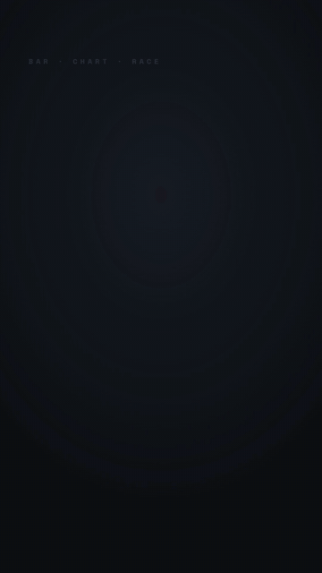

# 横向条形竞速榜 · Bar-Chart Race Leaderboard



**效果:** 横向条形你追我赶地生长，名次实时重排、互相超越，冠军最后冲到第一并高亮 — 排名类数据最上头的那种镜头。
*What it delivers: horizontal bars grow and overtake each other, ranks reshuffling live, the winner surging to #1 and highlighting — the most addictive shot for any ranking data.*

## Prompt（复制给你的 coding agent · copy-paste to your coding agent）

```text
Create a 1080x1920 vertical HyperFrames composition — a 7-second bar-chart
race on {BG — dark #101216 or light #F4F1EA}.

Title: {TITLE e.g. "哪个平台涨粉最快"}. Contestants (4-6, label + a few
keyframe values showing the race): {NAME: [v0, v1, v2, vFinal] each — e.g.
抖音 [10,45,80,120] / 小红书 [20,40,95,140] / B站 [15,30,50,72] …}. Winner:
{the highest final}. Accent for winner: {ACCENT}; muted bars for the rest.

Build the race:
- Horizontal bars, one per contestant, left-anchored, with the label +
  a live value readout at the bar's tip (tabular-nums). Bar length maps to
  value / current-max (so the axis rescales as values grow).
- CRITICAL — reorder by RANK: each bar's vertical Y position is its current
  rank slot. When values cross, bars swap slots by tweening their Y (the
  overtake). Author the value keyframes; compute rank order per keyframe;
  tween both width (value) and Y (rank) between keyframes.

Animation timeline (~7s):
- 0.0-0.6s  title + empty track + labels settle in.
- 0.6-5.4s  THE RACE: sweep through the value keyframes (each segment ~1.2s,
            power1.inOut). Bars grow, the max-axis rescales smoothly, and
            whenever two bars cross in value they SWAP Y slots (0.5s
            power2.inOut) — the overtake. Tip value readouts count
            continuously.
- 5.4s      FINISH: the winner surges to #1, its bar flashes to ACCENT,
            grows a touch past the others, a crown/#1 badge pops on its row,
            baseline flash.
- 5.6-7s    hold: final standings held; winner bar glows/breathes; a
            "recap" ping down the rank list (1→N).

Render safety (required): one single paused GSAP timeline on
window.__timelines["main"]; author value keyframes + computed rank-Y per
keyframe (no Math.random, no live data); bars via transform/width tweens;
count-ups on plain objects; no Date.now; finite repeats; root div with
data-composition-id="main" data-duration="7" data-width="1080"
data-height="1920".
```

## 要点 Key technique notes

- **Two things animate per bar: WIDTH (value) and Y (rank slot).** The overtake — bars swapping vertical position when values cross — is the addictive part; a race where bars only grow but never reorder is just a slow bar chart.
- Rescale the max-axis smoothly as values grow (bar length = value / current-max) so the leader always fills the track and the race stays legible.
- Author the value keyframes by hand for drama (let the underdog lead early, winner surge late) — real data can slot in later; the *race shape* is the story. For maximum payoff, tune the keyframes so the winner's final overtake into #1 lands ON the finish beat (keep its second-to-last value just below the current leader) rather than mid-race.
- Everything from authored keyframes, zero live data or randomness — deterministic and repeatable.
