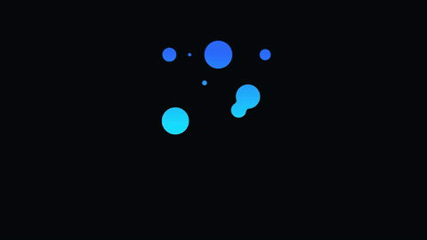

# 液态融合 Logo · Liquid Metaball Morph



**效果:** 几团液滴在画面里游动、相互吸引、"啵"地融成一个整体 logo — 有机的表面张力，像水银聚成形状。
*What it delivers: droplets drift, attract, and fuse into one whole logo with a gooey surface-tension pop — organic, like mercury pulling itself into shape.*

## Prompt（复制给你的 coding agent · copy-paste to your coding agent）

```text
Create a 1920x1080 HyperFrames composition — a 5-second liquid-metaball logo
formation on {BG — flat #0A0C10 or brand-tinted dark}.

My logo: {YOUR_LOGO — a simple bold mark or wordmark works best; describe its
silhouette}. Brand color: {ACCENT e.g. #2F6BFF}.

Build the goo:
1. The metaball effect = an SVG filter: feGaussianBlur (stdDeviation ~14) →
   feColorMatrix that ramps alpha hard ("1 0 0 0 0  0 1 0 0 0  0 0 1 0 0
   0 0 0 20 -9"). Apply this filter to a <g> containing several solid-fill
   circles. When two blurred circles overlap, the alpha ramp fuses their
   edges into one gooey blob — that's the whole trick.
2. Put N circles (6-10) in that filtered group, all in ACCENT. Their target
   resting positions spell/form the logo silhouette (place them along the
   mark's skeleton). Off-target, they scatter.
3. A crisp copy of the final logo (unfiltered, on top, starts opacity 0) is
   what you fade in at the end for clean edges.

Animation timeline (~5s):
- 0.0-2.2s  the circles drift in from scattered positions toward their
            logo-forming targets (staggered, ease power2.inOut), varying
            radius slightly (breathing). As they approach, neighbors' goo
            bridges connect — the mark assembles as one continuous liquid.
- 2.2s      surface-tension SETTLE: all circles reach target and do a
            unified squash-stretch (scaleY 1.12→1 then 0.96→1, 0.3s
            elastic-ish) — the "it just coalesced" jiggle.
- 2.5s      the crisp logo copy cross-fades in over the goo (0.4s) so edges
            go sharp; a soft specular highlight sweeps once.
- 2.9-5s    hold: the goo layer keeps a slow internal wobble (circles orbit
            ±4px, sine, finite repeats) under the crisp logo, so the surface
            stays alive; gentle overall breathe.

Render safety (required): one single paused GSAP timeline on
window.__timelines["main"]; circle motion authored (no Math.random — vary by
index); no Date.now; finite repeats; root div with data-composition-id="main"
data-duration="5" data-width="1920" data-height="1080".
```

## 要点 Key technique notes

- **The goo is one SVG filter**, not per-blob physics: blur + a steep `feColorMatrix` alpha ramp on a group of solid circles. Overlapping blurred edges fuse; that's the metaball look for free.
- Place the circles' resting targets along your mark's skeleton — the logo is "spelled" by where the blobs settle.
- Fade a crisp unfiltered logo copy in at the end — the goo gives you the *formation*, the copy gives you clean final edges.
- Vary circle motion by index (`i * 0.13` offsets), never `Math.random`, or the render won't be deterministic.
