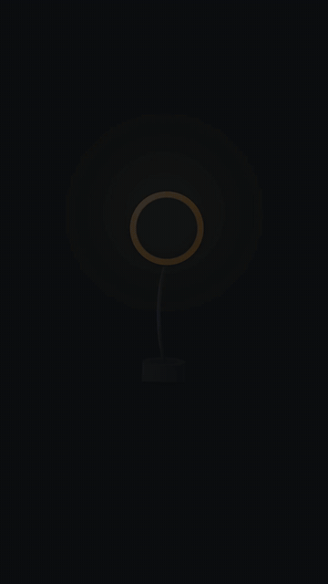

# 产品特性标注广告 · Feature-Callout Product Ad



**效果:** 产品居中悬浮缓转，标注线一根根从产品上"长"出来，特性标签依次点亮 — 发布会 Keynote 那种规格拆解镜头。
*What it delivers: the product floats center-stage, callout lines grow out of it one by one, and feature labels light up in sequence — the spec-breakdown shot from a launch keynote.*

## Prompt（复制给你的 coding agent · copy-paste to your coding agent）

```text
Create a 1080x1920 vertical HyperFrames composition — a 7-second feature-callout
product ad.

My product: {PRODUCT — attach a PNG with transparent background, or describe it
so the agent can build a clean CSS/SVG render of it}.
3 features to call out: {FEATURE_1 / FEATURE_2 / FEATURE_3, each ≤6 words}.
Brand accent: {ACCENT_COLOR}. Background: {DARK_STUDIO #101114 or LIGHT #F4F1EA}.

Build the stage:
- Studio background: flat base + ONE blurred radial light pool behind the
  product (blurred element, not full-bleed gradient) + faint floor shadow
  ellipse under the product.
- Product centered at ~45% height, ~55% frame width. Give it a slow floating
  idle for the whole duration: y ±10px sine yoyo + rotate ±1.2° — it must
  never sit still.
- Each callout = a dot anchored on the product edge + an elbow line (SVG path,
  two segments) + a label group (feature NAME in bold 44px — your primary
  language — plus one 26px accent-color sub-line, e.g. the EN translation)
  sitting in clear space. Place the 3 callouts at staggered heights
  left/right/left so they never overlap the product or each other.

Animation timeline (~7s):
- 0.0–0.8s  product rises in (y 60→0, scale .92→1, power3.out) as the light
            pool blooms behind it.
- 1.2s      callout 1: anchor dot pops (scale 0→1, back.out(2)), the elbow line
            DRAWS from the dot outward (SVG strokeDashoffset, 0.35s power2.out),
            then the label reveals behind a clip-path wipe (inset right→0) +
            its sub-line fades up.
- 2.6s      callout 2, same grammar, other side.
- 4.0s      callout 3.
- 5.2s      emphasis pass: each callout's dot pings once in sequence (scale
            1→1.5→1 + a 40% opacity ring expanding) — a quick "recap sweep".
- 5.8–7s    hold: product keeps floating, labels keep a ≤1% breathe.

Render safety (required): one single paused GSAP timeline on
window.__timelines["main"]; no Date.now / Math.random; root div with
data-composition-id="main" data-duration="7" data-width="1080"
data-height="1920".
```

## 要点 Key technique notes

- **The callout grammar is dot → line-draw → label-wipe**, always in that order, always from the product outward — it reads as "this part, explained."
- Elbow lines (two segments) look engineered; straight diagonal lines look like a meme caption.
- The product's idle float is what makes the frame feel premium — anchor everything else, keep the hero breathing.
- 3 callouts max. The recap ping-sweep at the end buys retention without adding content.
