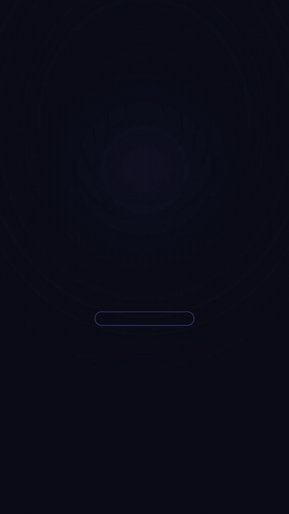

# 结尾 CTA 卡 · CTA End-Card



**效果:** 视频结尾 5 秒: logo 落定、主张一句话入场、按钮呼吸发光、指尖光点点击 — 把"看完了"变成"点了"。
*What it delivers: the 5-second video ending — logo settles, one-line value prop lands, the button breathes and glows, a fingertip light taps it. Turns "watched" into "clicked."*

## Prompt（复制给你的 coding agent · copy-paste to your coding agent）

```text
Create a 1080x1920 vertical HyperFrames composition — a 5-second CTA end-card.

Brand: {BRAND_NAME} + {LOGO — text lockup is fine}.
Value line: {ONE_SENTENCE, ≤12 words, e.g. "3 分钟做出你的第一条动画"}.
CTA button text: {CTA e.g. "免费开始"}. Brand colors: {PRIMARY} on {BG_COLOR}.

Layout (center column, generous air):
- Logo lockup at ~30% height.
- Value line beneath it, bold 64px, max 2 lines centered.
- CTA button at ~62% height: pill, 88px tall, PRIMARY fill, bold 44px label,
  soft glow shadow in the same color.
- Small trust line under the button (26px, 60% opacity): {TRUST_LINE e.g.
  "已有 12,000+ 创作者在用" — use a made-up-obviously-rounded number or omit}.

Animation timeline (~5s):
- 0.0s   background blooms in (a blurred radial brand-color pool scales up
         behind the column).
- 0.3s   logo drops in (y -40→0, scale 1.1→1, power3.out) with ONE soft
         confetti burst behind it — 10–12 small brand-colored rectangles
         flying out on authored paths (each a fromTo with fixed x/y/rotation
         targets, staggered 0.02s), falling with fade. Authored positions,
         no randomness.
- 1.0s   value line reveals per-word (each word y 20→0, opacity, 0.06 stagger).
- 1.8s   button pops in (scale .8→1, back.out(2.2)) and immediately starts its
         idle: glow-shadow breathing (spread/opacity yoyo, 1.2s period) +
         scale 1.0→1.02 yoyo.
- 2.6s   a shine sweep crosses the button once (skewed white gradient strip,
         x -120%→220%, 0.5s).
- 3.4s   THE TAP: a soft fingertip light-dot descends onto the button, button
         depresses (scale .96, 0.08s) and releases with a ring ripple
         (an expanding 0-to-1.6-scale fading circle), trust line fades in.
- 3.8–5s hold: button keeps breathing; everything else still.

Render safety (required): one single paused GSAP timeline on
window.__timelines["main"]; confetti paths are authored fromTo targets (no
Math.random); no Date.now; root div with data-composition-id="main"
data-duration="5" data-width="1080" data-height="1920".
```

## 要点 Key technique notes

- **The button is the protagonist.** Everything else lands once and holds; only the button keeps moving (breathe + shine + tap) — motion = "look here."
- The simulated tap-with-ripple is the strongest CTA cue available without a real finger on screen.
- Confetti with authored paths renders deterministically AND lets you art-direct the burst shape (fan upward, not spray everywhere).
- One value line, one button. An end-card with two CTAs converts like zero.
