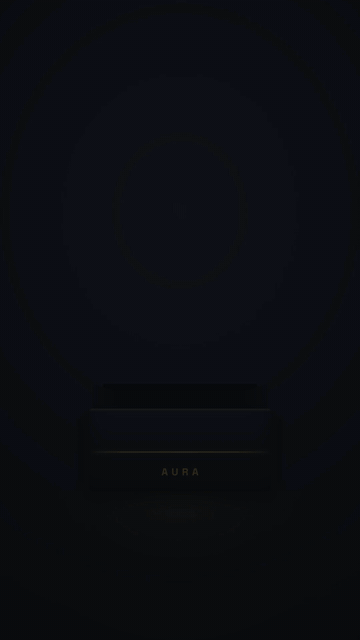

# 开箱揭晓广告 · Unboxing Reveal



**效果:** 盖子掀开、光从箱子里溢出，产品带着光晕缓缓升起悬停旋转 — 拆盒那一下的仪式感，全用代码做出来。
*What it delivers: the lid lifts, light spills out of the box, and the product rises out on a beam of glow to hover and turn — the ceremony of the unbox, all in code.*

## Prompt（复制给你的 coding agent · copy-paste to your coding agent）

```text
Create a 1080x1920 vertical HyperFrames composition — a 6-second unboxing
reveal ad on {BG — a soft studio gradient in the brand family}.

My product: {PRODUCT — attach a transparent PNG, or describe it for a clean
CSS/SVG render}. Box color: {BOX_COLOR}. Brand accent: {ACCENT}.

Build the scene:
- A CSS box built from planes: a front face + two side faces (slight
  perspective via a stage with perspective: 1600px) + a separate LID plane
  hinged at its back edge (transform-origin: top; it rotates open on X).
- Inside/behind the box, a "light" element: a bright radial glow + 3-4 soft
  light-beam wedges (skewed gradients) that are hidden until the lid opens.
- The product sits low inside the box at start (clipped by the box front),
  ready to rise.

Animation timeline (~6s):
- 0.0-0.5s  box settles in (scale .94→1, y 20→0, power3.out).
- 0.6-1.2s  LID OPENS: rotateX 0→-115° on its back hinge (back.out(1.4)),
            and as it lifts the interior GLOW blooms + light beams fan up
            out of the opening.
- 1.3-2.4s  product RISES: translateY up out of the box to hover at center,
            scale 0.8→1, power2.out; the box front stays in front of its
            lower half (z-order) so it reads as emerging FROM the box.
            8-12 authored sparkle/confetti bits puff up around it.
- 2.5-4.6s  hover + slow turn: product rotationY -12°→12° (sine) while
            floating y ±10; a spec callout or tagline fades in beside it.
- 4.6s      a light sweep crosses the product (premium glint).
- 4.7-6s    settle + hold: box dims back, product front-and-center breathing,
            optional CTA/logo lockup fades in at the bottom.

Render safety (required): one single paused GSAP timeline on
window.__timelines["main"]; sparkles authored by index (no Math.random); no
Date.now; finite repeats; root div with data-composition-id="main"
data-duration="6" data-width="1080" data-height="1920".
```

## 要点 Key technique notes

- **Z-order sells the emergence:** keep the box's FRONT face in front of the product's lower half so the product reads as rising *out of* the box, not floating over it.
- The lid is a separate plane hinged at its back edge (`transform-origin: top` + `rotateX`); the interior glow + light beams are hidden until it opens — the light spill is the wow beat.
- Rise with `power2.out` (decelerate into the hover), then a gentle turn — a linear rise or a fast spin cheapens the reveal.
- Build the box from CSS planes with a shared `perspective` stage; no 3D engine needed.
