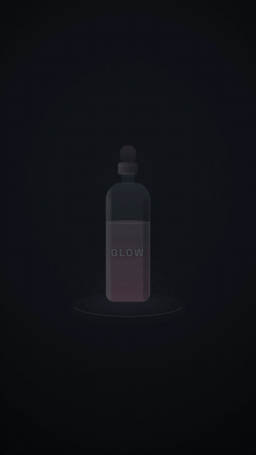

# 360° 转台展示广告 · Turntable 360 Spin



**效果:** 产品立在转台上匀速转一圈，聚光灯打在它身上，转到关键角度时规格标注弹出 — 电商详情页的镇店镜头。
*What it delivers: the product stands on a turntable making one smooth revolution under a spotlight, spec callouts popping at key angles — the hero shot of a product page.*

## Prompt（复制给你的 coding agent · copy-paste to your coding agent）

```text
Create a 1080x1920 vertical HyperFrames composition — a 6-second 360° product
turntable on {BG — dark studio #101216 with a spotlight pool}.

My product: {PRODUCT — best with a SEQUENCE of angle images if you have them
(front/45/side/back...), OR a symmetric CSS/SVG product that reads at any
angle, OR accept a fake-3D "billboard" spin (see notes)}. Accent: {ACCENT}.
3 spec callouts: {SPEC_1 / SPEC_2 / SPEC_3}.

Build the turntable:
- A round pedestal (ellipse with a rim highlight) + a soft contact shadow
  under the product that SQUASHES/STRETCHES as the product turns (widest at
  profile angles).
- The spin: if you have angle frames, cross-fade/swap them across the
  rotation (e.g. 8-12 frames mapped to 0-360°, swapped on a stepped timeline).
  If not, rotate a CSS product on rotationY under perspective: 1500px, or spin
  a "billboard" (a flat product image with a subtle horizontal scaleX
  0..1..0 fake-turn + a moving specular band to imply a rounded surface).
- A spotlight cone from top + a rotating rim-light glint that tracks the
  turn (brightest edge follows the leading face).

Animation timeline (~6s):
- 0.0-0.5s  product + pedestal rise in; spotlight blooms on.
- 0.5-5.2s  ONE full smooth revolution (rotationY 0→360°, ease power1.inOut
            so it eases in and out of the turn, not robotic-linear). Contact
            shadow + rim glint track it.
- at ~1.6s / 3.0s / 4.4s  as the product presents its 3 key faces, a spec
            callout pops beside it (dot + short line + label, back.out) and
            retracts before the next — synced to the rotation angle.
- 5.2-6s    settles front-facing; a final light sweep + all-specs-recap
            (the 3 dots ping in sequence); hold with a slow idle wobble.

Render safety (required): one single paused GSAP timeline on
window.__timelines["main"]; frame swaps / rotation authored on the timeline;
no Date.now / Math.random; finite repeats; root div with
data-composition-id="main" data-duration="6" data-width="1080"
data-height="1920".
```

## 要点 Key technique notes

- **Best input is an angle sequence** (even 8 frames) swapped across the rotation — that's a true 360. No frames? Rotate a CSS product under `perspective` (works great for a bottle/can whose silhouette barely changes), or fake it with a "billboard." Note: a flat `rotationY` billboard collapses to a thin line at the exact profile crossings (90°/270°, a few frames) — fine for a round object where the back face + specular carry it, but for a product with a distinctive profile, use angle frames or a full-width cylinder with only the label/specular wrapping.
- The contact shadow doing squash/stretch (widest at profile) is a huge realism cue for almost no work — don't skip it.
- Ease the revolution (`power1.inOut`), and time the spec callouts to the ANGLE where each face presents — a callout for the back of the product while the front is showing breaks the illusion.
- The tracking rim-glint (brightest edge follows the leading face) is what makes even a fake spin read as a lit 3D object.
