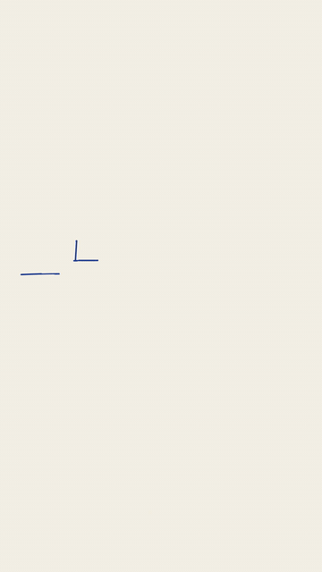

# 沸腾线手绘场景 · Boiling-Line Scene



**效果:** 一幅线稿场景一笔笔画出来，然后整幅画"沸腾"起来 — 线条永远在极轻微地抖，像每一帧都是重新手画的。静止的矢量瞬间有了纸上动画的体温。
*What it delivers: a line-art scene draws itself on, then the whole drawing "boils" — strokes forever micro-wobbling as if every frame were redrawn by hand. Static vectors suddenly have the body heat of paper animation.*

## Prompt（复制给你的 coding agent · copy-paste to your coding agent）

```text
Create a 1080x1920 vertical HyperFrames composition — a 6-second
hand-drawn "boiling line" scene on warm paper {PAPER, e.g. #F7F2E7}
with a faint paper-grain texture (static baked, 3%).

The scene (single-stroke SVG line art, {INK, e.g. #1F3A93}, 4px round
caps): {SCENE, e.g. a desk with a laptop, a steaming mug, and a small
plant} — 3 objects, simple closed-ish contours, plus 3 steam curls
above the mug. One handwritten-style caption {CAPTION, e.g. "先坐下来"}
in a casual script/kaiti face, {ACCENT, e.g. #D84A3A}.

THE BOILING TECHNIQUE (this is the entry's whole point):
- Define THREE SVG filters, identical except seed:
  <filter><feTurbulence type="fractalNoise" baseFrequency="0.012 0.02"
  numOctaves="2" seed="11|47|83"/><feDisplacementMap in="SourceGraphic"
  scale="7"/></filter>
- Apply to the whole sketch group. Inside the paused timeline's
  onUpdate, swap which filter is active via
  Math.floor(tl.time() * 8) % 3  — 8 swaps/second, 3 plates, exactly
  like paper animation shot on threes. Timeline-derived = fully
  deterministic under seek (parallel render workers agree).

Animation timeline (~6s):
- 0.0–2.2s  draw-on: each object's strokes draw via getTotalLength →
            dasharray/dashoffset, objects 0.5s apart (laptop → mug →
            plant), each finishing with a 1px settle-bounce. Boiling
            is ALREADY active during the draw — the line wobbles as
            it's being laid down.
- 2.4s      the caption handwrites in — a left→right clip-rect wipe
            along its -2° tilt (font glyphs have no stroke paths to
            dash; the wipe reads as writing).
- 2.8–5.2s  living hold: steam curls draw-and-fade on a loop (finite
            repeats, staggered); the plant does one slow lean ±2°; the
            laptop screen shows 2 line-art text lines that blink-type
            in; everything boils continuously.
- 5.2–6.0s  wink + settle: the mug hops once (y -8, squash on land),
            steam puffs a bigger curl, boiling continues to the last
            frame — the drawing never freezes.

Render safety (required): one paused GSAP timeline on
window.__timelines["main"]; filter-plate swapping driven ONLY by
timeline time (no Date.now / Math.random / requestAnimationFrame
state); finite repeats; root div with data-composition-id="main"
data-duration="6" data-width="1080" data-height="1920".
```

## 要点 Key technique notes

- **沸腾 = 3 块 feTurbulence 位移滤镜按 `floor(tl.time()*8)%3` 轮换** — "8fps 三格拍摄"的数字复刻；用 time 驱动才 seek 确定，parallel worker 渲染才一致。
- `scale=7` 是甜点位：>10 线条散架，<4 看不出手绘感。baseFrequency 横向低纵向高，抖动更像手抖。
- 画的过程中沸腾就要开着 — 边画边抖才是"手在画"；画完才抖像加了特效。
- 最后一帧也在沸腾。手绘场景里"静止"就是死亡。
