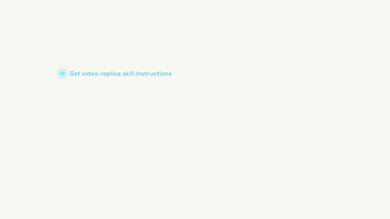

# Agent 任务流 · Agent Task Stream



**效果:** 彩色状态点沿一条正在生长的竖线依次亮起，任务行逐条浮现，随后一段"AI 正在思考"的文字流式打出，关键词带彩色荧光底 — 把 agent 干活的过程本身拍成镜头。
*What it delivers: colored status dots light up along a growing vertical line, task rows surface one by one, then an "AI reasoning" paragraph streams in word-by-word with color-highlighted key spans — the agent's work itself becomes the shot.*

## Prompt（复制给你的 coding agent · copy-paste to your coding agent）

```text
Create a 1920x1080 HyperFrames composition — a 7-second "agent task stream"
scene on a warm paper white {BG, e.g. #FAFAF7}.

Content: three task rows —
{TASK_1, e.g. "Get video-replica skill instructions"} (dot color {C1, e.g.
#38C8F0}), {TASK_2, e.g. "Analyze reference video content and style"} (dot
{C2, e.g. #F06FD8}), {TASK_3, e.g. "Draft the shot-by-shot storyboard"} (dot
{C3, e.g. #9F7BFF}).
Then a streaming paragraph {PARAGRAPH — 3–4 lines, ~40 words} in which 3
key phrases {SPAN_1} {SPAN_2} {SPAN_3} carry highlight pills tinted {C1}/
{C2}/{C3} at ~22% opacity.

Build:
- Everything lives in one column (~1100px wide, left-aligned text,
  the block itself centered in the frame with generous right whitespace):
  task list on top, paragraph below.
- Task row = a 16px dot (solid color + a soft matching halo) + a 30px
  medium-grotesque line in its dot's color at 80% strength.
- A thin vertical connector line (2px, 12% black) runs through the dots and
  GROWS downward as rows appear (scaleY with transform-origin top).
- Paragraph: 30px/48px-leading dark gray text. Words are individual spans.
  Highlight pills are rounded rects behind the key phrases (inset -2px
  vertically), tinted per-phrase.
- A small block caret rides at the stream head while the paragraph types.

Animation timeline (~7s):
- 0.0–0.5s  task 1: dot pops (scale 0→1, back.out(2.2)) + its halo blooms
            once; the line wipes in behind a clip-path (right inset
            100%→0 — revealing left→right from the line's start).
- 0.9–1.4s  connector grows to task 2; task 2 dot + line, same grammar.
- 1.8–2.3s  connector grows to task 3; task 3 enters.
- 2.6–5.6s  the paragraph streams in word-by-word: each word is a span
            with a quick opacity 0→1 + y 6→0, staggered ~14 words/s;
            the caret is driven by a SEPARATE stepped index tween
            (snap: 1) so it rides the last visible word; each highlight
            pill wipes in (scaleX 0→1, origin left) the moment its phrase
            completes.
- 5.6–6.2s  the three dots convert to "done": each flashes once then shows
            a tiny white check (check strokes drawn via dashoffset),
            150ms apart.
- 6.2–7.0s  hold with life: halos breathe on offset phases (finite yoyo),
            the caret blinks twice and rests.

Render safety (required): one single paused GSAP timeline on
window.__timelines["main"]; word streaming and caret use stepped/finite
tweens on the timeline; no Math.random / Date.now; root div with
data-composition-id="main" data-duration="7" data-width="1920"
data-height="1080".
```

## 要点 Key technique notes

- **这是"过程即证明"镜头** — 观众看的不是结果，是 agent 的工作流。任务行文案要具体（动词开头），泛泛的"Processing…"浪费这个镜头。
- 逐词流式 = 每词一个 span + stepped index tween；逐字符打字在段落长度下太慢，逐词才有"AI 吐字"的节奏。
- 荧光底在短语打完的那一刻 scaleX 划入 — 和文字同时出现会读成静态排版。
- 白底场景的"高级感"全靠克制：黑灰字 + 三个低饱和彩点，别加投影和渐变。
