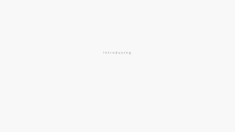

# 功能星环 Logo · Feature-Orbit Logo



**效果:** "Introducing" 小字铺垫，logo + 字标落定画面中心，五六个功能胶囊卡从四周弹出、各带一点迷你 UI（波形/头像/开关），绕着 logo 缓缓漂浮 — 一镜讲完"我是谁 + 我有什么"。
*What it delivers: a small "Introducing" setup, the logo + wordmark land center, then 5–6 feature chips pop up around it — each with a bit of mini-UI (waveform / avatars / toggle) — and drift on gentle orbits. Who you are + what you've got, in one shot.*

## Prompt（复制给你的 coding agent · copy-paste to your coding agent）

```text
Create a 1920x1080 HyperFrames composition — a 7-second "feature orbit"
brand intro on {BG, e.g. clean white #FCFCFA with a faint dotted grid}.

Content: brand {BRAND, e.g. "NOVA VIDEO"} with a simple geometric CSS/SVG
logo mark (e.g. a rounded-triangle play glyph filled with a {C1, e.g.
#8A5CFF}→{C2, e.g. #38C8F0} gradient — build it, don't load an image).
Setup word: {SETUP, e.g. "Introducing"}. Six feature chips:
{FEATURE_1, e.g. "Smart Pick"} {FEATURE_2, e.g. "Talk-to-Edit"}
{FEATURE_3, e.g. "AI Editor"} {FEATURE_4, e.g. "Smart Audio"}
{FEATURE_5, e.g. "Inspiration Center"} {FEATURE_6, e.g. "Auto Captions"}.

Build:
- Center lockup: logo mark (~120px) + heavy wordmark side by side.
- Chips: white rounded cards (radius 16px, soft wide shadow, 1px 8% black
  stroke), sized to READ at thumbnail scale — ~32px labels, generous
  padding. Each = colored icon dot + label + ONE piece of mini-UI flavor
  that varies by chip: a 5-bar waveform, a 3-avatar row (colored circles),
  a small toggle switch, a sparkle glyph, a text-snippet line, a mini
  thumbnail rect — pair each chip with the mini-UI that best matches its
  feature's meaning. Mini-UI elements are pure CSS/SVG; grow bars/lines
  by animating height/width (not scaleY/scaleX) so card layout stays
  stable under seeking.
- Place chips at 6 staggered radial positions around the lockup (2 top, 2
  sides, 2 bottom; radii ~320–460px, varied so it reads scattered, not a
  perfect ring). Each chip has a 1px connector stub angled toward the
  center (24–40px long, fading toward the chip, ~35% peak opacity —
  visible, or the "galaxy" read is lost).
- Depth: 2 chips at 1.0 scale, 2 at 0.9, 2 at 0.8 with slight blur.

Animation timeline (~7s):
- 0.0–0.6s  {SETUP} fades in small above center (letter-spacing 0.3em,
            opacity 0→1), then nudges up and dims as the lockup arrives.
- 0.8s      lockup lands: mark pops (scale 0→1, back.out(1.8)) then the
            wordmark slides out from behind it (x -40→0 behind a clip-path
            wipe); one subtle shadow pulse under both.
- 1.6–3.4s  chips pop in one at a time, 300ms apart, alternating sides
            (scale .6→1 back.out(2), y 20→0, shadow blooming); each chip's
            mini-UI plays its beat ON ARRIVAL: waveform bars stagger up,
            avatars cascade in 60ms apart, the toggle flips ON, sparkle
            twinkles once.
- 3.6–6.4s  orbit hold: every chip drifts on its own ellipse (x ±10–18px,
            y ±6–12px, periods 2.4–3.6s varied BY INDEX, sine.inOut yoyo,
            finite repeats); the mark breathes ≤1.05; connector stubs
            shimmer opacity in a slow stagger.
- 6.4–7.0s  closing wink: the gradient inside the mark sweeps once
            (background-position tween) and one chip's icon dot pings.

Render safety (required): one single paused GSAP timeline on
window.__timelines["main"]; all drift periods/phases derived from index (no
Math.random / Date.now); finite repeat counts; root div with
data-composition-id="main" data-duration="7" data-width="1920"
data-height="1080".
```

## 要点 Key technique notes

- **每个胶囊卡要带一口"活的迷你 UI"** — 波形、头像、开关。纯文字胶囊读出来是标签云，带 UI 才读成"功能"。
- 半径和角度故意不均匀：完美圆环 = 模板感；散点 + 连接短线 = 产品星系。
- 到场即演：mini-UI 的动画拍在卡片落地那一拍，之后只留漂浮 — 全程循环播 UI 动画会抢 logo。
- 漂浮周期按 index 错开（2.4–3.6s 不等），全员同相位漂浮一眼假。
