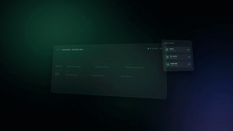

# 极光玻璃面板 · Aurora Glass Panels



**效果:** 深黑上流动着绿紫蓝极光，两三块带透视倾角的玻璃 UI 面板在不同景深漂浮 — 时间轴上色块片段依次点亮、波形跳动 — 产品 UI 活在一个电影感的虚空里。
*What it delivers: green-violet-blue aurora drifts over deep black while two or three perspective-tilted glass UI panels float at different depths — timeline clips lighting up in sequence, waveforms ticking — your product UI living inside a cinematic void.*

## Prompt（复制给你的 coding agent · copy-paste to your coding agent）

```text
Create a 1920x1080 HyperFrames composition — an 8-second "aurora void with
floating UI" scene.

Content: a main timeline panel with {N, e.g. 6} clip chips, labels like
{CLIP_LABELS, e.g. "Wind Through Alley / Night Insects Bed / Distant
Highway Loop / Pressure Drone / Gravel Footsteps / Fabric Scrape"}, color
coded {CA, e.g. #35E0A0 for ambience} / {CB, e.g. #9F7BFF for foley}; a
smaller side panel = a stack of 3 tool rows; accent glow {CA}.

Build:
- Aurora background: deep black base + 3–4 HUGE blurred radial-gradient
  blobs ({CA}/{CB}/deep blue, blur 100px+, 35–45% opacity — the aurora
  must READ as aurora, err brighter) that drift and slowly cross-fade —
  blurred ELEMENTS, never a full-bleed CSS gradient (H.264 banding). Add
  a static fine-grain overlay (SVG turbulence baked once, ~4% opacity)
  to kill remaining banding.
- Panels live in a perspective:1400px parent.
  Main panel (~980x420px): glass recipe = white 6% fill, 1px white 22%
  stroke, radius 20px, tilted rotateY -14° rotateX 6°; inside: a header
  row, 2 timeline lanes (group chips by type across the lanes), and the
  clip chips = rounded pills (label + a 12-bar mini waveform), tinted
  {CA} or {CB} at 18% fill with matching 1.5px stroke. The {CA} accent
  also tints the side panel's tool accents and the end-of-scene edge
  bloom on the main panel.
  Side panel (~340x300px) floats right, deeper (scale .85, blur 1.5px,
  tilted the other way).
- One thin light streak (rotated translucent white bar) will sweep across
  the main panel's face during the hold.

Animation timeline (~8s):
- 0.0–1.2s  aurora blobs bloom from 0 opacity; panels rise from below with
            depth stagger (deep one first, y 80→0, opacity, power3.out),
            settling into their tilts.
- 1.4–3.8s  the clip chips light ON in sequence, 350ms apart (opacity
            .25→1, fill 4%→18%, scale .96→1) and each chip's waveform bars
            stagger up as it lights (heights assigned by index trig).
- 3.8–6.8s  hold with life: both panels parallax-drift on offset ellipses
            (x ±14px / y ±8px, rotateY ±2°, sine.inOut yoyo, finite,
            periods differing by depth); waveform bars on the {CA}
            chips keep ticking (scaleY yoyo on index-offset phases); the
            light streak sweeps the main panel once at ~4.5s.
- 6.8–8.0s  one chip (the hero, e.g. chip 4) pulses brighter + a soft {CA}
            outer glow blooms on the main panel edge; aurora keeps
            drifting to the last frame.

Render safety (required): one single paused GSAP timeline on
window.__timelines["main"]; waveform heights/phases from index math (no
Math.random / Date.now); finite repeat counts; grain is a static baked
texture; root div with data-composition-id="main" data-duration="8"
data-width="1920" data-height="1080".
```

## 要点 Key technique notes

- **极光 = 大 blur 半径的漂浮色块，永远不要整屏 CSS 渐变** — 渲染成 H.264 会出色带；再叠一层静态细颗粒保险。
- 玻璃面板配方：白 6% fill + 白 22% 1px 描边 + 圆角 20 + 倾角。倾角是关键 — 正对镜头就是网页截图，斜 14° 才是"UI 活在空间里"。
- 两块面板漂浮相位、周期都要错开，深的那块加 blur + 缩小 — 景深是拿视差卖的。
- 色块片段按"类型=颜色"编码（环境声绿 / 拟音紫），密度本身讲"能力多"。
