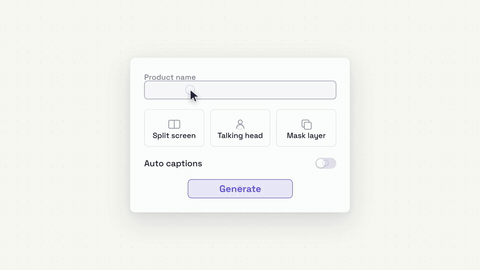

# 光标演一遍 · Cursor UI Performance



**效果:** 一枚光标像演员一样把你的产品 UI 用了一遍 — 点输入框打字、选卡片、开开关、按下 Generate 看结果弹出。不是截图，是"有人在用"。
*What it delivers: a cursor performs your product UI like an actor — clicks a field and types, picks an option card, flips a toggle, hits Generate and the result pops. Not a screenshot: someone is using it.*

## Prompt（复制给你的 coding agent · copy-paste to your coding agent）

```text
Create a 1920x1080 HyperFrames composition — an 8-second "cursor demo"
scene on warm paper {BG, e.g. #FAF9F5} with a faint dotted grid.
Accent: {ACCENT, e.g. #6C5CE7}.

Content: a centered product panel (~880x620px, white, radius 20px, soft
wide shadow, 1px 8% black stroke) containing:
- a text field labeled {FIELD_LABEL, e.g. "Product name"},
- a row of 3 option cards {OPT_1/OPT_2/OPT_3, e.g. "Split screen /
  Talking head / Mask layer"}, each a small card with a tiny CSS
  pictogram,
- a toggle row {TOGGLE_LABEL, e.g. "Auto captions"},
- a primary button {CTA, e.g. "Generate"} — idle state is accent-OUTLINE
  (tinted fill, accent border/text), so the press-to-solid-accent fill
  reads as a state change.
And an SVG cursor arrow (with a soft drop shadow) — the actor.

Animation timeline (~8s):
- 0.0–0.7s  panel rises in (y 40→0, opacity, power3.out); controls are
            in their idle states.
- 0.9s      cursor glides in from lower-right (power2.inOut — eased
            curves, never linear) to the text field and CLICKS: field
            border lights accent, a caret appears.
- 1.2–2.6s  typing: {TYPED_TEXT, e.g. "Verdant face mask"} appears
            char-by-char (stepped index tween, snap: 1) with the caret
            blinking (finite stepped repeats).
- 3.0s      cursor glides to option card 2 and CLICKS: the card pops
            (scale .96→1.03→1), gets an accent border + a check badge;
            siblings dim to 70%.
- 4.2s      cursor flips the toggle: knob slides, track tints accent,
            one tiny ring ripple.
- 5.0s      cursor presses {CTA}: button dips (scale .94), fills accent,
            then shows a 3-dot working pulse (dots bounce in sequence,
            finite repeats) for ~0.8s.
- 6.0s      RESULT: a result card slides up from the button area
            (a thumbnail rect + title line + a small ✓ pill), landing
            with back.out(1.4); confetti = 8 tiny accent rects popping
            radially (index-derived angles, 0.4s, fade).
- 6.4–8.0s  hold: result thumbnail's inner gradient drifts, cursor
            glides to rest at lower-right, panel micro-breathes ≤1%.
Every CLICK = three simultaneous cues: cursor dips 8% scale, target
reacts, and a 24px ring ripples from the click point (opacity .5→0).

Render safety (required): one single paused GSAP timeline on
window.__timelines["main"]; typing via stepped substring tween; no
Math.random / Date.now; finite repeats; root div with
data-composition-id="main" data-duration="8" data-width="1920"
data-height="1080".
```

## 要点 Key technique notes

- **光标永远走弧线缓动（power2.inOut），永远不瞬移** — 直线匀速一眼假。到达 → 停 1-2 帧 → 再点击。
- 每次点击三件事同时发生：光标缩一下 + 目标响应 + 点击处波纹环。缺一个就不像"真的按下去了"。
- Generate 后必须有 0.8s 的"工作中"三点跳 — 直接弹结果反而不可信；等待本身是表演的一部分。
- UI 全部手搓假数据（规则 3：不放真品牌/截图），但控件状态要真实：选中卡片时兄弟卡片要变暗。
