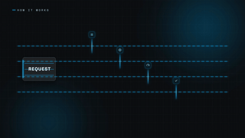

# 流水线拆解 · Conveyor Stages



**效果:** 一个整块从左侧驶入，"咔"地裂成四个带标签的阶段块，各自骑上自己的轨道走过工位 — 每站亮灯、盖章、跳表 — 右侧重新合体驶出。把"流程/架构"拍成一条流水线。
*What it delivers: a solid block drives in from the left, cracks into four labeled stage blocks that ride their own tracks through lit stations — each stamps, checks, or gauges — then re-assemble and exit right. Your pipeline/architecture as an assembly line.*

## Prompt（复制给你的 coding agent · copy-paste to your coding agent）

```text
Create a 1920x1080 HyperFrames composition — an 8-second "conveyor
stages" pipeline scene on deep charcoal {BG, e.g. #101216}.
Accent: {ACCENT, e.g. #00B3FF}; warm check color {OK, e.g. #35E0A0}.

Content: one input block labeled {INPUT, e.g. "REQUEST"}, splitting into
4 stage blocks {STAGE_1..4, e.g. "PARSE / PLAN / RENDER / SHIP"}, each
riding a horizontal track lane. Title {TITLE, e.g. "How it works"} small
at top-left.

Build:
- Editorial dark-glass look: charcoal base + 2 dim blurred accent pools
  + a subtle 1px grid at 5% white. 4 track lanes across the middle band
  (2px lines at 18% white with BRIGHT accent dash-flow — the lanes must
  clearly read at thumbnail scale), vertically spaced ~120px.
- Blocks: rounded glass rects (~260x92px, white 8% fill, 1.5px white
  30% stroke, ~34px label centered, an accent left-edge bar) — sized to
  READ at 480px preview width. The input block is 2x taller with 3
  faint seam lines (= four fused bands), labeled {INPUT}; the four
  stage blocks start stacked inside its footprint and fan out at the
  split.
- 4 stations: one per lane at staggered x positions — each a visible
  "gate": a vertical glow bar spanning the lane + a glyph plate
  (~48px), with its own mini-action: (1) a scan line sweeps the block,
  (2) a stamp glyph drops with overshoot, (3) a gauge arc fills, (4) a
  check pops. Station actions must be legible at 480px.

Animation timeline (~8s):
- 0.0–0.8s  lanes + stations fade in, dashes start flowing (finite
            dash-offset tween across full duration); title wipes in.
- 1.0s      the fused input block drives in from off-left (power2.out)
            and pauses at the split point; seam lines flash accent.
- 1.6s      THE SPLIT: the four blocks separate vertically onto their
            lanes (y to lane positions, 80ms stagger, back.out(1.3)) —
            a brief accent flash at the seams as they part.
- 2.2–5.4s  each block rides its lane rightward at its own speed and
            hits its station: block pauses 0.4s, the station's
            mini-action plays (scan / stamp / gauge / check, each with
            an {OK} flash on complete), then the block continues.
            Stagger the four arrivals so there is always exactly one
            action playing.
- 5.8s      convergence: the four blocks reach the merge point and
            re-fuse (y back to center, seams glow then fade), the
            merged block's label swaps to {OUTPUT, e.g. "RESULT"} and
            it gets an {OK} outline pulse.
- 6.4s      it exits right with a small speed-line whoosh; the lanes'
            dash-flow keeps running.
- 6.8–8.0s  hold: stations breathe dimly; title stays; one lane dash
            glints as a wink.

Render safety (required): one single paused GSAP timeline on
window.__timelines["main"]; dash flow via finite tweens; no Math.random
/ Date.now; root div with data-composition-id="main" data-duration="8"
data-width="1920" data-height="1080".
```

## 要点 Key technique notes

- **节奏排布让"永远恰好有一个工位在表演"** — 四个动作重叠就是噪音，之间有空拍就是拖。
- 裂开与合体时接缝要闪一下 accent — 观众要看见"它们本是一体"。
- 轨道虚线全程流动（dashoffset），流水线才有"运转中"的底噪。
- 四个工位四种动作（扫描/盖章/仪表/打勾）— 同一种动作重复四次会读成循环动画。
