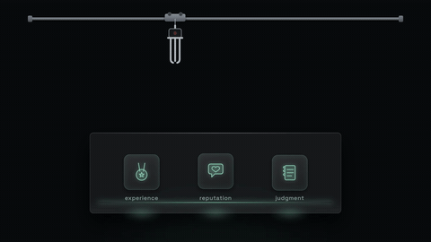

# 爪机抓空 · Claw Grab-and-Miss



**效果:** 机械爪对着玻璃柜里三枚发光信物一抓 — 滑脱、空手而回；再抓、更快、还是空。信物们得意地脉动，落一句"有些东西抓不走"。一镜讲清"AI 拿不走什么"。
*What it delivers: a mechanical claw descends on three glowing tokens in a glass case — grabs, slips, comes up empty; tries again faster, still empty. The tokens pulse in triumph and the payoff lands: "some things can't be taken." The "what AI can't grab" metaphor in one shot.*

## Prompt（复制给你的 coding agent · copy-paste to your coding agent）

```text
Create a 1920x1080 HyperFrames composition — a 7-second "claw grab and
miss" metaphor scene on deep charcoal {BG, e.g. #0C0E12}.
Token glow: {GLOW, e.g. mint #8ACAB1}; claw color: cold steel gray with
a {RED, e.g. #D84A3A} status lamp.

Content: a glass display case (bottom half of frame) holding 3 glowing
tokens, each a simple SVG glyph on a puck: {TOKEN_1, e.g. a medal =
"experience"}, {TOKEN_2, e.g. a heart bubble = "reputation"}, {TOKEN_3,
e.g. a notebook = "judgment"} — small caption under each. A crane claw
(3-finger SVG, simple line-art mechanics) hanging from a top rail.
Payoff line {PAYOFF, e.g. "Some things can't be scraped."} — white,
accent on the key word.

Build:
- The case: glass recipe (white 6% fill, 1px white 25% stroke, radius
  16) with a thin {GLOW} inner floor light; tokens sit on the floor,
  each with its own under-glow pool and a slow idle bob (±4px, offset
  phases by index).
- The claw: rail + cable (a line that extends/retracts) + a 3-finger
  claw group whose fingers pivot open/closed at their hinges.
- The tokens' glow is the "life" that makes the slip believable.

Animation timeline (~7s):
- 0.0–0.8s  case + tokens fade up, glows bloom, idle bob starts (never
            stops); claw hangs at top, lamp dim.
- 1.0–2.6s  ATTEMPT 1 (deliberate): claw trolley slides above token 2
            (power2.inOut), lamp blinks {RED}, cable extends (claw
            descends), fingers open → close around the token — the
            token SQUASHES down (scaleY .85), its glow flares — then
            SLIPS out (token pops back up with a bounce, back.out(2))
            as the claw retracts EMPTY, fingers clacking closed on
            nothing. The case gives one small shake (±3px, 0.2s).
- 2.9–4.2s  ATTEMPT 2 (faster, 0.75x the duration): same grammar over
            token 3; slip is quicker, the glow flare brighter, and this
            time all three tokens do a tiny synchronized "nuh-uh"
            shake (rotation ±3°, 0.25s) as the claw comes up empty.
- 4.5s      the claw retracts fully to the rail and its lamp goes dark
            (defeated); a small steam/dust puff (3 fading circles) at
            its hinge.
- 4.9s      the three tokens pulse in sequence (scale 1→1.12→1 + glow
            bloom, 150ms apart) — triumphant; their captions brighten.
- 5.3s      {PAYOFF} lands centered above the case (words stagger in,
            y 24→0, blur 4→0, accent word colored).
- 5.8–7.0s  hold: tokens keep bobbing, glows breathe, payoff
            micro-breathes ≤1.02.

Render safety (required): one single paused GSAP timeline on
window.__timelines["main"]; all idle bobs/phases index-derived, finite
repeats; no Math.random / Date.now; root div with
data-composition-id="main" data-duration="7" data-width="1920"
data-height="1080".
```

## 要点 Key technique notes

- **滑脱的说服力 = token 的 squash→弹回 + 辉光闪** — 爪子空合的"咔哒"只是配角，被抓的东西"挣脱"才是戏眼。
- 第二次尝试必须更快（0.75x）且失败得更干脆 — 重复而不加速就是循环动画，加速才是"它急了"。
- 爪子的状态灯（红闪→熄灭）是它的表情；最后灯灭 + 尘雾一喷，挫败感就位。
- 三枚信物全程 idle 起伏、相位错开 — 它们是活的，这正是"抓不走"的原因。
