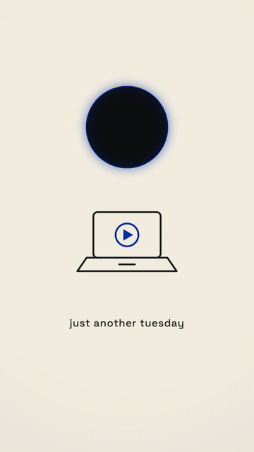

# 圆形吞没转场 · Circle-Swallow Takeover



**效果:** 亮色世界里悬着一个小小的暗圆窗，讲到那句金句 — 黑暗从圆窗里涌出来吞掉整个画面，世界翻转成暗色金句卡；几秒后黑暗缩回圆窗，亮色世界回来了。整集最重的一拍转场。
*What it delivers: a small dark circle window floats in a light world — then on the money line, the darkness surges out and swallows the whole frame, flipping the world into a dark statement card; seconds later it contracts back into the circle and the light world returns. The heaviest transition beat an episode can own.*

## Prompt（复制给你的 coding agent · copy-paste to your coding agent）

```text
Create a 1080x1920 vertical HyperFrames composition — a 7-second
"circle swallow" scene transition. (Same grammar works at 16:9.)

Two worlds:
- LIGHT world: warm cream {CREAM, e.g. #F5EFE2} with simple line-art
  content — e.g. a desk object glyph ({OBJECT, e.g. a laptop}) in
  {INK, e.g. #1F1F1D} with a colored accent {BLUE, e.g. #002FA7},
  plus a small caption {CAPTION_LIGHT}. Alive: object idle-bobs,
  caption breathes.
- DARK world: near-black {DARK, e.g. #0B0C10} with slow-drifting ember
  particles (12 dots, positions/phases from index trig) and ONE serif
  statement {STATEMENT, e.g. "它正在靠近"} in warm gold {GOLD, e.g.
  #E8C87A}, large, centered.
The portal: a circle (~Ø340px) parked in the upper third of the light
world, showing the dark world inside (a masked window), with a 3px
{BLUE} rim and a soft outer glow.

Build: the dark world is a full-frame layer UNDER the light world;
the light world gets a circular clip-path HOLE... simplest robust way:
put the DARK layer on top, masked by clip-path: circle(R at cx cy),
and animate R. Rim = a separate circle element tracking the same R.

Animation timeline (~7s):
- 0.0–1.0s  light world establishes: object bobs, caption wipes in;
            the portal breathes gently (R ±3%), embers drift inside it.
- 1.6s      pre-shock: the portal's rim flashes and the circle SUCKS IN
            5% (R dips, ease power2.in) — the inhale before the bite.
- 1.8–2.6s  THE SWALLOW: R expands from 170px to full-frame coverage
            (compute the radius from the portal center to the FARTHEST
            frame corner — ~1520px at 9:16; power3.in — accelerating,
            hungry); the rim thins and dissolves as it passes the
            edges; light-world content gets pulled 20px toward the
            portal as it's covered (being "eaten").
- 2.7–4.6s  dark reign: embers drift across the full frame; the
            {STATEMENT} slams in (scale 1.15→1, 5 frames; wrapping to
            two centered lines at large size is fine — dramatic) with
            a soft gold under-glow; it micro-breathes.
- 4.8–5.6s  THE RETURN: R contracts back to 170px (power3.out —
            spent, receding); statement exits INTO the shrinking circle
            (scale down toward the portal center + fade); rim redraws.
- 5.6–7.0s  light world resumes: object does one relieved bounce,
            caption swaps to {CAPTION_AFTER, e.g. "但先别慌"}; the
            portal keeps breathing — it's still there.

Render safety (required): one paused GSAP timeline on
window.__timelines["main"]; ember positions from index trig; no
Math.random / Date.now; finite repeats; root div with
data-composition-id="main" data-duration="7" data-width="1080"
data-height="1920".
```

## 要点 Key technique notes

- **吞没用 power3.in（加速咬合），回缩用 power3.out（力竭退潮）** — 两个方向的缓动不对称，才有"活物"的感觉。
- 吞没前 0.2s 的"倒吸一口"（R 先缩 5%）是最值钱的细节 — 攻击前的蓄力。
- 被吞时亮色内容要往圆心被拽 20px — 世界是被"吃掉"的，不是被"盖住"的。
- 暗世界统治期必须换一套字体气质（衬线 + 金色）— 转场转的是世界观，不只是颜色。
