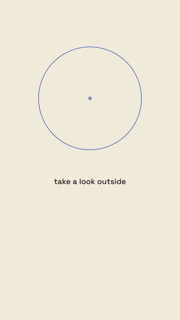

# 舷窗开阖 · Iris Porthole Reveal



**效果:** 亮色版面上，一扇带彩色描边的圆形"观测窗"虹膜式旋开 — 窗里是另一个世界（深空、电影感内景），内景带视差地活着；看完一眼，舷窗又阖上。日常画面里开一扇看向别处的窗。
*What it delivers: on a light layout, a rimmed circular "observation window" irises open — inside is another world (deep space, cinematic), alive with parallax; after the glimpse, the porthole irises shut. A window to elsewhere, floating in an everyday frame.*

## Prompt（复制给你的 coding agent · copy-paste to your coding agent）

```text
Create a 1080x1920 vertical HyperFrames composition — a 6-second "iris
porthole" reveal. (Same grammar works at 16:9.)

The stage: warm cream {CREAM, e.g. #F5EFE2}; a small caption
{CAPTION, e.g. "看一眼正在发生的"} in {INK, e.g. #1F1F1D} below the
porthole zone. Porthole: circle Ø~620px centered upper-middle
(~(540, 590) in the 1080x1920 frame), rimmed with a 4px {RIM, e.g.
Klein blue #002FA7} stroke + a soft outer glow.

The inner world (built CSS/SVG, no real footage): deep navy space
{SPACE, e.g. #060A18} with a starfield (40 dots, 3 size/parallax
tiers, positions from index trig), a huge dark ring silhouette
(a thick-stroke circle, {RING e.g. #10141F} with a thin cyan rim-light
arc) drifting very slowly toward a small glowing planet dot. The inner
scene is larger than the porthole (~1.3x) so it can parallax-pan
behind the mask.

Animation timeline (~6s):
- 0.0–0.7s  cream stage + caption establish; where the porthole will
            be, a faint dotted circle guide fades in (the "closed"
            state) with a tiny {RIM} keyhole glint at its center.
- 1.0–1.8s  IRIS OPEN: clip-path circle radius 0→310px with a two-step
            ease (power2.in for the first 20%, then power3.out — the
            shutter "catches" then glides); the rim stroke draws
            around the circumference in sync (dashoffset), glow blooms.
- 1.8–4.2s  the glimpse: inner world parallax — starfield tiers pan at
            different speeds (±14/8/4px), the ring drifts ~20px closer
            to the planet, the planet pulses twice; the whole inner
            layer slow-pans 30px so the window feels deep. Caption
            below swaps to {CAPTION_2, e.g. "它每天都更近一点"}.
- 4.2s      one {RIM} ring ripple expands off the porthole edge — the
            "remember this" ping.
- 4.6–5.4s  IRIS SHUT: radius →0 (power3.in), rim un-draws, a final
            glint at the vanish point; the dotted guide circle
            remains, breathing — the window is closed, not gone.
- 5.4–6.0s  hold: cream world quiet, caption micro-breathes.

Render safety (required): one paused GSAP timeline on
window.__timelines["main"]; starfield from index trig; no Math.random
/ Date.now; finite repeats; root div with data-composition-id="main"
data-duration="6" data-width="1080" data-height="1920".
```

## 要点 Key technique notes

- **虹膜开启用两段缓动（先 power2.in "咬合"，再 power3.out 滑开）** — 机械快门的手感；单段 ease 像普通的圆形放大。
- 内景要做得比舷窗大 ~1.3 倍再在遮罩后平移视差 — 窗才有"厚度"，贴死不动就是一张贴纸。
- 关窗后留一圈呼吸的虚线 — "窗还在，只是关上了"，为下一次开启埋因果。
- 舷窗是"重复使用的签名装置"：一集用 2–3 次，每次内景递进；本条目只演一开一阖。
