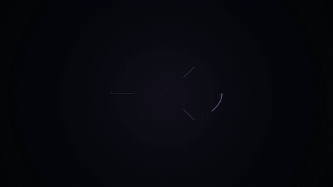

# 符文法阵 · Rune Sigil Circle



**效果:** 双环法阵在地上画出自己 — 外环带八个符文字符顺时针转，内环逆时针转，中央主符呼吸发光；符文逐个点亮蓄力，最后一声爆发。技能释放、召唤、加载中的"仪式感"皮肤。
*What it delivers: a double-ring sigil circle draws itself — outer ring with eight rune characters rotating clockwise, inner ring counter-rotating, a breathing center glyph; runes charge up one by one to a final burst. The ritual skin for skill-casts, summons, or a loading state.*

## Prompt（复制给你的 coding agent · copy-paste to your coding agent）

```text
Create a 1920x1080 HyperFrames composition — a 6-second "rune sigil
circle" VFX demo on near-black {BG, e.g. #0A0B10}.
Sigil color: {SIGIL, e.g. #B98CFF}; charge color {CHARGE, e.g.
#FFD84A}.

Content, all SVG strokes (2–3px, round caps), centered, tilted into
pseudo-3D by scaleY .55 on the whole sigil group (a floor circle, not
a wall poster):
- OUTER ring: a circle Ø~640px + a ring of 8 rune glyphs ({RUNES —
  8 single characters, e.g. seal-script-style CJK or invented angular
  glyphs built from 3–4 strokes each}) sitting on the circumference,
  each counter-rotated so it stays upright as the ring spins.
- INNER ring: Ø~380px with 4 small diamond nodes + a dashed circle.
- CENTER: one hero glyph {CENTER_GLYPH, e.g. "启"} ~90px, with a soft
  {SIGIL} under-glow pool.
- 3 thin connector spokes between the rings.

Animation timeline (~6s):
- 0.0–1.4s  THE DRAW: outer circle draws on (dashoffset, 0.8s
            power2.inOut), then inner ring + spokes (0.4s, overlap),
            then the 8 runes stroke-draw in quick sequence (60ms
            apart); the under-glow blooms as the draw completes.
- 1.4s+     ROTATION (whole duration): outer ring group rotates +360°
            over ~10s-worth of rate (so ~160° across the comp,
            linear); inner ring rotates OPPOSITE at 1.4x rate; each
            rune counter-rotates to stay upright (child rotation =
            -parent rotation, tweened in sync). Center glyph breathes
            (scale 1→1.06, glow swing, sine yoyo, finite).
- 2.0–4.0s  THE CHARGE: runes ignite one by one in ring order, 250ms
            apart — each flips from {SIGIL} to {CHARGE} color with a
            scale pop 1→1.3→1 and a tiny vertical light tick rising
            off it; the under-glow warms by 8% per ignited rune; the
            spokes' dashes begin flowing inward.
- 4.2s      full charge: inner ring's 4 diamonds flare simultaneously;
            the whole sigil inhales (scale .96, 0.2s).
- 4.4s      THE BURST: center glyph flares white-hot for 2 frames; a
            vertical light pillar (a tall blurred {CHARGE} gradient
            bar) shoots up from the center (scaleY 0→1 from bottom,
            0.3s, then fades); 2 shockwave rings expand along the
            floor plane (scaleX full / scaleY .55 to match the tilt);
            8 ember dots rise (index-derived offsets).
- 4.8–6.0s  afterglow: pillar gone, runes cool back to {SIGIL} color
            one by one (reverse order), rotation continues, center
            glyph breathes — the circle stays armed to the last frame.

Render safety (required): one paused GSAP timeline on
window.__timelines["main"]; rune upright-compensation tweened in sync
with ring rotation; ember offsets from index trig; no Math.random /
Date.now; finite repeats; root div with data-composition-id="main"
data-duration="6" data-width="1920" data-height="1080".
```

## 要点 Key technique notes

- **整组 scaleY .55 压成"地面法阵"** — 贴地的透视感是仪式感的一半；爆发时的冲击环也要按同样的椭圆比例扩散。
- 双环必须反向转、速率错开 1.4x — 同向同速像贴图在转，反向咬合才像机关在运转。
- 符文要做"随环公转 + 自身反向自转保持直立" — 字符躺着转会读成花纹，站着转才是文字。
- 蓄力的节奏：逐个点亮 → 集体一闪 → 全阵吸气 0.2s → 爆发。爆发前的"吸气"比爆发本身更重要。
